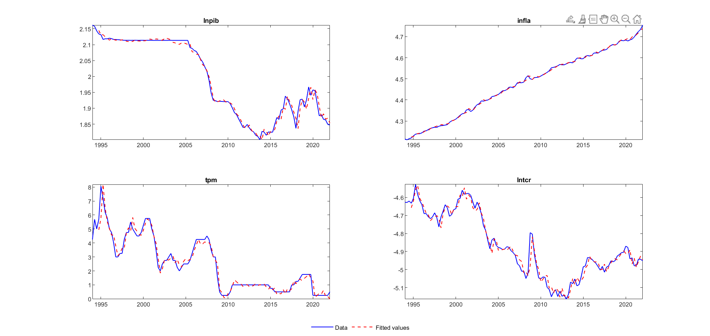
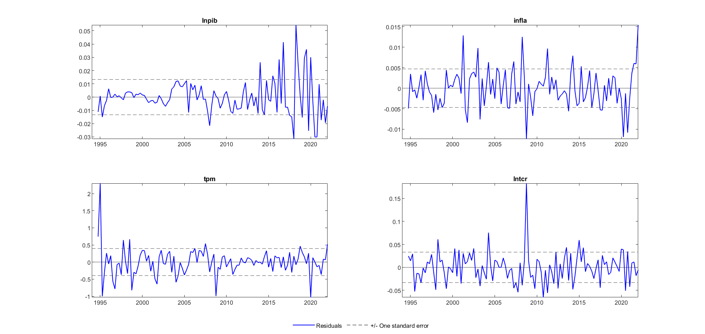
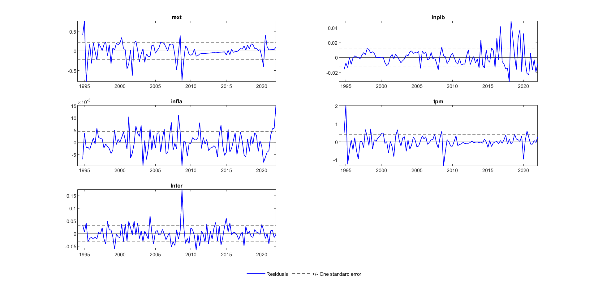
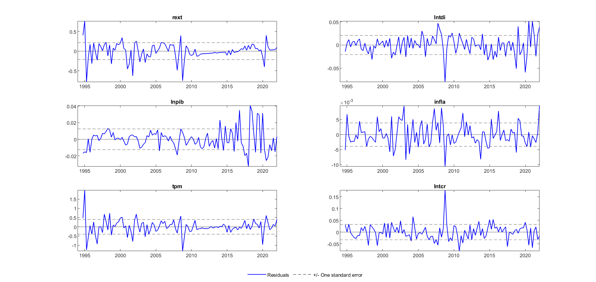
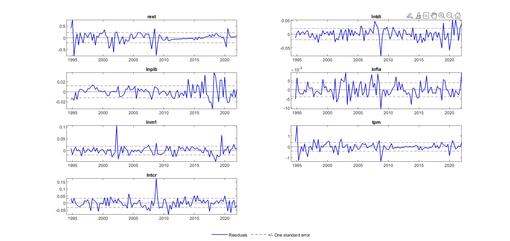
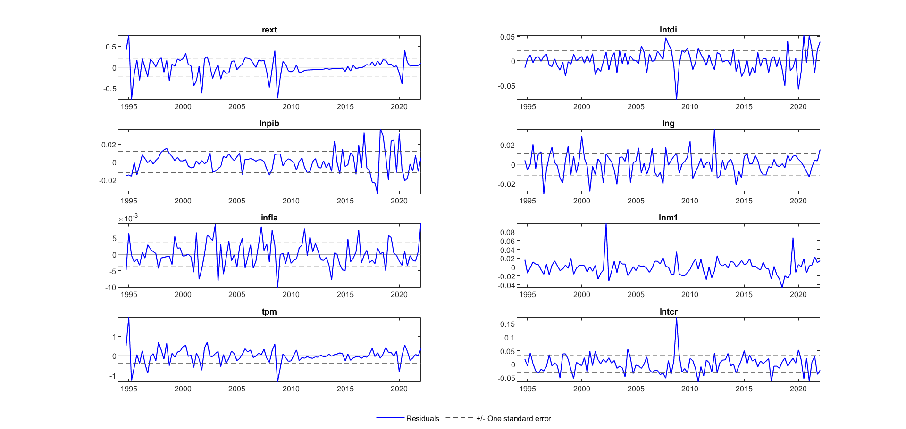
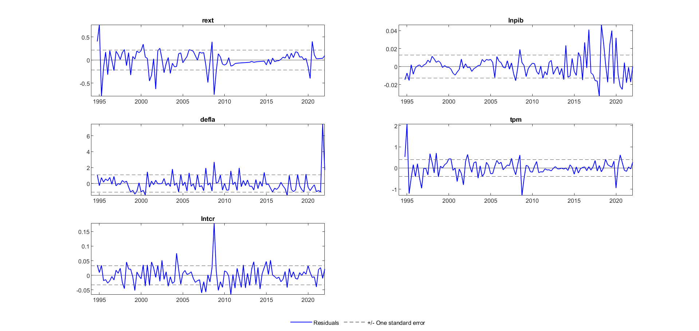
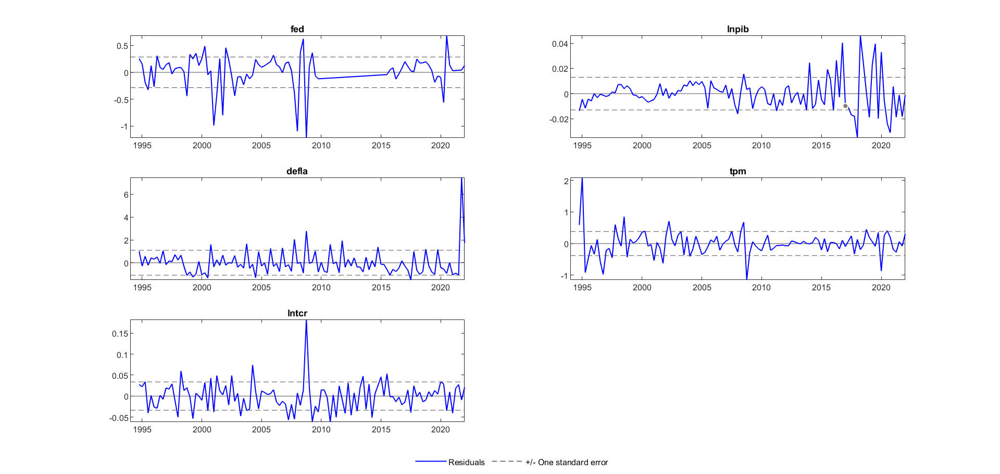

# Part 1 

[Download document (excersises chapther 11)](https://drive.google.com/drive/u/0/folders/1RZOutpun_CCGriqZta94c639J7ycveYe)

```{r setup, include=FALSE}
knitr::opts_chunk$set(echo = FALSE, warning = FALSE, dev = 'svg', message = FALSE)
library(tidyverse)
library(lubridate)
library(patchwork)
library(forecast) # autoplot, auto.arima
library(tseries) # Dickey-Fuller
library(ggfortify)
library(xts)
library(readxl)
library(showtext)

theme_set(theme_minimal(base_size = 12))
theme_set(theme_minimal(base_size = 14))
font_add_google("IBM Plex Sans", "ibm")
showtext_auto()
```

```{r, funciones, include=FALSE}
get_time_series <- function(data, time, value){
  # https://stackoverflow.com/questions/11422493/using-r-how-do-i-create-a-time-series-object-with-dates 
  xts(
    x = pull(data, value),
    order.by = pull(data, time),
    frequency = 12
  ) 
}

tidy_adf_test <- function(serie){
  # ?adf.test
  # https://www.r-bloggers.com/2021/12/augmented-dickey-fuller-adf-test-in-r/
  # https://rstudio-pubs-static.s3.amazonaws.com/843574_4aec57ae7a0d43ff8d0c152729f0ed2c.html#prueba-de-ra%C3%ADz-unitaria-de-dickey-fuller
  
  serie  %>%  
    na.omit() %>% 
    adf.test() %>% 
    broom::tidy() %>% 
    mutate(
      `resultado 95%` = ifelse(
        p.value < 0.05,
        "Es I(0),  no unit-root",
        "Existe unit-root")
    ) %>% 
    rename(`Valor-p` = p.value) %>% 
    select(method, `Valor-p`, everything())
}

autoplot_acf_pact <- function(serie){
  
  p1 <- ggAcf(serie) + labs(title = NULL)
  p2 <- ggPacf(serie) + labs(title = NULL)
  
  p1 + p2
  
}

modelos_arma <- function(serie, ar_orders = 1:6, ma_orders = 1:6){
  
  # test nombre_colmm <- "infsv_sa"
  
  modelos <- crossing(ar = ar_orders, ma = ma_orders) %>% 
    pmap_df(function(ar = 6, ma = 3){
      
      cli::cli_alert_info("Ajustando ARMA({ar}, {ma})")
      
      ajuste <- Arima(serie, order = c(ar, 0, ma), include.mean = TRUE, method = "ML")
      
      # autoplot(serie)
      # autoplot(ajuste$residuals)
      
      # ggAcf(serie)
      # ggAcf(ajuste$residuals)
      
      # tsdiag(ajuste)
      
      output <- broom::glance(ajuste)
      
      output <- select(output, -nobs)
      
      output
      
      Box.test(serie, type = "Ljung-Box")
      Box.test(ajuste$residuals, type = "Ljung-Box")
      
      # tsdiag(ajuste)
      
      test_residuos <- Box.test(ajuste$residuals, type = "Ljung-Box")
      test_residuos <- broom::glance(test_residuos)
      
      output <- output %>% 
        add_column(`Box-Ljung test residuos p value` = test_residuos$p.value) 
      
      output <- output %>% 
        mutate(`Ajuste` = str_glue("ARMA({ar}, {ma})"), .before = 1)
      
      output
      
    })
  
  modelos %>% arrange(desc(`Box-Ljung test residuos p value`))
  modelos %>% arrange(sigma)
  modelos %>% arrange(desc(logLik))
  modelos %>% arrange(desc(BIC))
  modelos %>% arrange(desc(AIC))
  
  modelos <- modelos %>%
    arrange(desc(`Box-Ljung test residuos p value`))
  
  auto.arima(serie, max.p = 6, max.q = 6, stepwise = FALSE)
  
  modelos
  
}

modelo_summary <- function(fit){
  
  bind_cols(broom::tidy(fit), confint(fit))
  
}

plot_ajuste <- function(modelo){
  
  modelo$x %>% 
    as.data.frame() %>% 
    set_names("serie") %>% 
    rownames_to_column("periodo") %>% 
    as_tibble() %>% 
    mutate(
      periodo = ymd(periodo),
      ajuste = fitted(modelo)
      ) %>% 
    pivot_longer(cols = -periodo) %>% 
    
    ggplot() +
    geom_line(aes(periodo, value, color = name)) +
    scale_color_viridis_d(begin = 0.3, end = 0.8)
    
}
```

# Part 2

Abstract

## The overshooting hypothesis in the data

In [1976](https://www.jstor.org/stable/1831272) Dornbusch present an important macroeconomic theory about *expectations and exchange rate dynamic*. Dornbusch's **overshooting** exchange rate **hypothesis** sugest that an increase in the interest rate should cause the nominal exchange rate to appreciate **instantaneously**, and then depreciate in line with uncovered interest parity (UIP) (Bjørnland, 2009)

More precisly, in his model the dynamic aspects of exchange rate determination arise from the assumption that exchange rates and asset markets adjust rapidly relative to goods markets.

In particular, in the short run

- A monetary expansion is shown to induce an **immediate** *depreciation in the exchange rate* and results therefore for *fluctuations in the exchange rate* and *the terms of trade*. 

- Rising prices may be accompanied by an *appreciating exchange rate* so that the trend behavior of exchange rates stands potentially in strong contrast with the cyclical behavior of exchange rates and prices.

- There is a direct effect of the exchange rate on domestic inflation. The exchange rate is a critical *channel* for the *transmission of monetary policy* to aggregate demand for domestic output.

- The effect of monetary policy on interest rates and exchange rates is *significantly affected by the behavior of real output*.

  - If real output is fixed, a monetary expansion will, in the short run, lower interest rates and cause the exchange rate to overshoot its long-run depreciation.
  - If output, responds to aggregrate demand, the exchange rate and interest rate changes will be *buffered*. While the exchange rate will still depreciate, it may no longer overshoot, and interest rates may actually rise.

However, only few empirical research have found support for Durnbusch hypothesis (see Sims (1992), Eichenbaum and Evans (1995) and Favero and Marcellino (2004) for Euro zona). An important problem that was adressed by these studies was the simultaneity between monetary policy and the exchange rate. To deal with it they used structural vector autoregressive models (VAR) (see Sims(1980)) by *"placing recursive, zero contemporaneous restrictions on the interaction between monetary policy and exchange rate"* (Bjørnland, 2009, p 65). In other word, we use VAR models by applying restrinctions that ensure a *unique* identification while contemporaneous interaction between monetary policy and the exchane rate. 

## Method

In order to conduct this, a *Cholesky decomposition* is applied to identify monetary policy shocks, that either

1. Restricts monetary policy from reacting contemporaneously to an exchange rate shock

2. Restricts exchange rate cannot react immediatly to a monetary policy shock (Favero and Marcellino, 2004)

The identification strategy consist in a $Z_t$ vector of the variables discussed above $Z_t = [i^*_t ~~~y_t ~~~ \pi_t ~~~ i_t ~~~ \triangle e_t]'$. 

where
- $\pi_t$ = inflation

- $y_t$ = log of real gross domestic product

- $i^*_t$ = three-month domestic interest rate

- $i_t$ = trade-weighted foreign interest rate

- $\triangle e_t$ = log trade-weighted real exchange rate

The VAR is assumed to be stable (ie, no eigenvalues lies outside the unit circle) and can be inverted and represented in terms of its MA process 

$$Z_t = C(L)\varepsilon_t$$
where 

-  $\varepsilon_t$ are reduced form of structural shocks ($\varepsilon$~ iid$(o, \Omega)$) (see Apendix 3)

- $C(L)= \sum_{j=0}^\infty C_j L^j$, $B(L)S = C(L)$

Finally, we can write the monetary policy shock $\varepsilon^{MP}$ and exchange rate shock $\varepsilon^{ER}$, assuming three zero restrictions on the relevant coefficents in the $S$ matrix.

$$
\begin{bmatrix}
i^*\\ 
y\\ 
\pi\\ 
i\\ 
\triangle e
\end{bmatrix}=B(L)
\begin{bmatrix}
S_{11}&0&0&0&0\\ 
S_{21}&S_{22}& 0 & 0 &0\\ 
S_{31}&S_{32}&S_{33}&0&0 \\ 
S_{41}&S_{42}&S_{43}&S_{44}&S_{45}\\ 
S_{51}&S_{52}&S_{53}&S_{54}&S_{55} 
\end{bmatrix}
\cdot 
\begin{bmatrix}
\varepsilon^{i^*} \\ 
\varepsilon^Y \\ 
\varepsilon^{CP} \\ 
\varepsilon^{MP} \\ 
\varepsilon^{ER}
\end{bmatrix}
$$

Also, we can uniquely identified and orthogonalized the shocks if we say

$$B_{51}(1)S_{14} +B_{52}(1)S_{24}+ B_{53}(1)S_{34} +B_{54}(1)S_{44} + B_{55}(1)S_{54} = 0$$

## Data

The model is estimated for Canada, which we have focused on because it is a small open country, *as the exchange rate is an important transmission chanel for shocks*. In particular, quarterly data from Q1 1994 to Q4 2021 are used ([Central Bank of Canada](https://www.bankofcanada.ca/rates/)). We do not use earlier starting period than 1994 because due to the comparability of data and it would make difficult to identidy a stable monetary policy regime (in 1983 experienced important structural changes) (see Clarida et al, 2000)

```{r data}
datos <- readxl::read_excel(here::here("input/canada-2.xlsx"), na = c("#N/A N/A"), sheet = 2) %>% janitor::clean_names(.)

datos <- datos %>%
  mutate(periodo = as.Date(year)) %>% 
  select(-year)

datos_long <- pivot_longer(datos, cols = -periodo)

ggplot(datos_long) +
  geom_vline(
    aes(xintercept = fecha),
    data = tibble(fecha = ymd("2008-01-01", "2020-01-01")),
    color = "darkred",
    size = 1
    ) + 
  geom_line(aes(periodo, value), color = "gray60") + labs(y = "") + 
  facet_wrap(vars(name), scales = "free_y", nrow = 2) 
```

*Figure 1*. Trimestral series `nominal_gdp`, `real_gdp`, `m1_money_supply`, `m2_money_supply`, `overnight_leading_rate`, `exchange_rate`  (1992- 2022)

As we can see in the *Figure 1* some variables have trend (seassonal or linear). However, we carry out extensive robusteness test to the VAR specification (7 VAR models).

Also, the lag order of the VAR is determined using various information criteria, suggesting that threee lags are acceptable. In some specification are 4 and 3, but in order to compare the estimation we use 3 lags (instead, hypothesis of autocorrelation and heteroscedasticity is rejected) (Appendix 2)

## Structural identification scheme


**Figure 2**. Canada: response to a monetary policy shock, using VAR approach and Bank of Canada data. 

Figure 2 graph the **impulse response** of a monetary policy shock (in +100 basis point)  (*TPM*) on interest rate, the level of the real exchange rate (*TCR*), GDP (*PIB*) and inflation (*Inf*). The upper and lower dashed lines plotted in each graph are probability bands. As we can see in the IRF $TPM \Longrightarrow TPM$ **a monetary policy shock increases interest rates temporarily**. The interest rate returns to its steady-state after 1-2 years (4 to 8 quarters). 

Futhermore, the monetary policy shock has a **immediate** and strong effect on the exchange rate, which is apreciated  by 1% (the results have to be rescaled from percentage basis points to percent, which coincides with Bjørnland, 2009). 
However, there is some delay in overshooting for 4-5 months, before the exchange rate quickly depeciates to equilibrium. In other words, **initial appreciation is small compared with the impact effect** (gradually depreciation back to the baseline). This is consistent with other papers (see Zettelmeyer, (2004) with daily data; Kearns and Manners (2006) with intraday data; Cushman and Zha (1997) that fin instant overshooting in an analysis of Canada). 

An importan issue is examine wheter there is any monetary response to exchange rate changes. If monetary policy reacts immediately to exchange rate variation, then we would **expect that the interaction between interest rate and exchange rates** is important to identify monetary policy shocks. 


**Figure 3**. Canada: response to a exchange rate shock, using VAR approach and Bank of Canada data. 

As we can see in *Figure 3*, an exchange rate shock that depreciates the exchange rate leads to produce a significant increase in the interest rate. Also, other studies show that the effect is largest in Canada than in other countries. For example, Bjørnland (2009) indicate that 

> *"Canada displays by far the highest degree of interaction between interest rate and exchange rate dynamics, as monetary policy shocks explan 41% of the exchange rate variation on impact, while 52% of the interest rate variation is explained by exchange rate shocks on impact"* (p. 70)

## Robustnes of results

Now, we will discuss three dimensions with respect to the baseline specification:

### 1. Specification of the VAR

### 2. Choice of variables included in the VAR

### 3. Fitted values



**Figure 4**. Fitted value for baseline model 

Figure 4 presents the evolution over time of the variables used in the baseline model (blue line) and their fitted values (red dotted line). As we can see, the model variables, i.e., government spending, inflation, overnight rate and real exchange rate, are predicted with a good fit. We can only identify that in the real exchange rate there is a small lag. 

This result is consistent even when the specifications of the model are changed (see figures 3, 6,9,12,15,18,21 in the [GitHub repository](https://github.com/valentinaandrade/econometrics-theoryIII/tree/main/input/code3/graphs)).


# References

[Bjørnland, H. C. (2009). Monetary policy and exchange rate overshooting: Dornbusch was right after all. Journal of International Economics, 79(1), 64-77.](https://www.sciencedirect.com/science/article/pii/S0022199609000841)

[*Hamilton, J. D. (1994). Time series analysis. Princeton University Press. Chapters 1-3*](https://books.google.cl/books?hl=es&lr=&id=BeryDwAAQBAJ&oi=fnd&pg=PP1&dq=hamilton+time+series+analysis&ots=BgCP8_bUhj&sig=3zy12_T3kgYPWPja8y5F1lJPZWQ&redir_esc=y#v=onepage&q=hamilton%20time%20series%20analysis&f=false)

[*Bockwell, P. J., & Davis, R. A. (1991). Time Series: Theory and Methods.. Chapter 3*](https://books.google.cl/books?hl=es&lr=&id=TVIpBgAAQBAJ&oi=fnd&pg=PA1&dq=brockwell+time+series+theory+and+methods&ots=nl2yfymmW6&sig=ktnul2bhi-vKD0GpvtG7KJIbol8&redir_esc=y#v=onepage&q=brockwell%20time%20series%20theory%20and%20methods&f=false)

[*Hayashi, F. (2011). Econometrics. Princeton University Press.*](https://books.google.cl/books?hl=es&lr=&id=QyIW8WUIyzcC&oi=fnd&pg=PP2&dq=hayashi+econometrics&ots=SFv20wuaK4&sig=kS7vf0fprmxEkGeJriM1xuX2B44&redir_esc=y#v=onepage&q=hayashi%20econometrics&f=false)

## Apendix A. The original model

### A. Capital mobility and expectations

#### Short run

$$r = r^* + x$$
where, $r$ is the domestic interest rate, $r^*$ interest rate of the world, $x$ expected rate of depreciation of the domestic currency.

$H_1$: If the domestic currency $x$ is expected to depreciate, interest rate on assets will exceed those abroad by the expected rate of depreciation. 

#### Long-run (perfect foresight expectations formation)

$$x = \theta (\bar e -  e)$$
States thar the expected rate of depreciation of the spot rate is proportional to the discrepancy between the long-run rate and the current spot rate. 

### B. The money market

Assuming a convetional demand for money, the log of which is linear in the log of real income and in interest rate we have

$$\lambda r + \phi y = m - p$$
where $m, p$ and $y$ denote the logs of nominal quantity of money, price level, and real income. Combing the last three equations we can obtain the relationship between the spot exchange rate, price level and the long-run exchange rate **given** that the money market clears and net assets yields are equalized:

$$p - m = -\phi y + \lambda r^* + \lambda \theta (\bar e - e)$$

With some simplication we can obtain

$$e = \bar e - (1/ \lambda \theta)(p- \bar p)$$
### D. The Goods market

$$ln D = u + \delta (e-p) + y \gamma - \sigma r$$
The rate of increase in the price of domestic goods $\dot p$ can be written as

$$\dot p = \pi ln (D/Y) = \pi [ + \delta (e-p) + y \gamma - \sigma r]$$

#### Expectations

$$\bar \theta (\lambda, \delta , \sigma , \pi)=\pi(\sigma /\lambda + \delta)/2 + [\pi ^2 (\sigma/\lambda + \delta)^2/4 + \pi \delta /\lambda]^\frac{1}{2}$$

## Appendix 3 - Residuals












